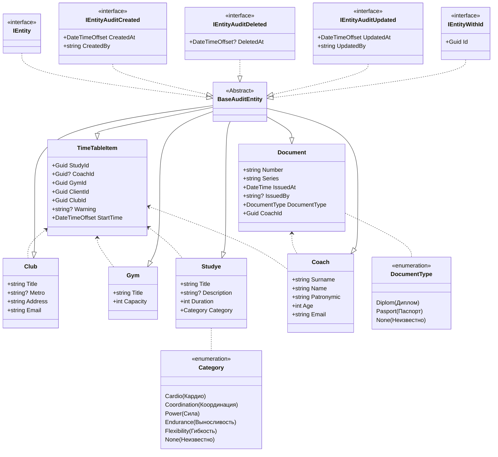

# Описание предметной области
Автоматизация расаписания занятий фитнеса

# Автор
Коршикова Эльвина Павловна студентка группы ИП 20-3

# Схема моделей

# Пример реального бизнес сценария


# SQL скрипт

```
INSERT INTO [dbo].[Clubs] 
           ([Id]  
           ,[Title]  
           ,[Metro]
		   ,[Address]
		   ,[Email]
           ,[CreatedAt]  
           ,[CreatedBy]  
           ,[DeletedAt]  
           ,[UpdatedAt]  
           ,[UpdatedBy])  
     VALUES 
           ('c24341b2-2682-4377-9970-274ba9d47663' 
           ,N'FITNESS HOUSE В ЛАХТЕ' 
           ,N'Беговая' 
		   ,N'пр. Лахтинский, д. 85' 
		   ,N'FHlahta@mail.ru' 
           ,GETDATE() 
           ,'Insert' 
           ,null 
           ,GETDATE() 
           ,'Insert') 

INSERT INTO [dbo].[Clubs] 
           ([Id]  
           ,[Title]  
           ,[Metro]
		   ,[Address]
		   ,[Email]
           ,[CreatedAt]  
           ,[CreatedBy]  
           ,[DeletedAt]  
           ,[UpdatedAt]  
           ,[UpdatedBy])  
     VALUES 
           ('4f8134dd-5e10-4264-b4d6-574569a25df6' 
           ,N'FITNESS HOUSE НА ЗАРЕЧНОЙ' 
           ,N'Парнас' 
		   ,N'Заречная улица, д. 15, к. 1, стр. 1' 
		   ,N'FHparnas@mail.ru' 
           ,GETDATE() 
           ,'Insert' 
           ,null 
           ,GETDATE() 
           ,'Insert') 

INSERT INTO [dbo].[Coaches] 
           ([Id] 
           ,[Surname] 
           ,[Name] 
           ,[Patronymic] 
           ,[Email] 
           ,[Age] 
           ,[CreatedAt] 
           ,[CreatedBy] 
           ,[DeletedAt] 
           ,[UpdatedAt] 
           ,[UpdatedBy]) 
     VALUES 
           ('735ad2d0-14fd-499a-b2bc-c99930273cfa' 
		   ,N'Коршикова'
		   ,N'Эльвина'
		   ,N'Павловна'
           ,'elvina.korshikova@mail.ru'  
           ,22 
           ,GETDATE() 
           ,'Insert' 
           ,null 
           ,GETDATE() 
           ,'Insert') 

INSERT INTO [dbo].[Coaches] 
           ([Id] 
           ,[Surname] 
           ,[Name] 
           ,[Patronymic] 
           ,[Email] 
           ,[Age] 
           ,[CreatedAt] 
           ,[CreatedBy] 
           ,[DeletedAt] 
           ,[UpdatedAt] 
           ,[UpdatedBy]) 
     VALUES 
           ('77238d15-b356-4bd0-8484-033abb098858' 
		   ,N'Слюсарев'
		   ,N'Юрий'
		   ,N'Дмитриевич'
           ,'ssslucarev@mail.ru'  
           ,31 
           ,GETDATE() 
           ,'Insert' 
           ,null 
           ,GETDATE() 
           ,'Insert')

INSERT INTO [dbo].[Documents] 
           ([Id] 
           ,[Number] 
           ,[Series] 
           ,[IssuedAt] 
		   ,[IssuedBy]
		   ,[DocumentType]
		   ,[CoachId]
           ,[CreatedAt] 
           ,[CreatedBy] 
           ,[DeletedAt] 
           ,[UpdatedAt] 
           ,[UpdatedBy]) 
     VALUES 
           ('826d67a5-84d0-48f8-9c63-e401c561dd36' 
           ,N'457912' 
           ,N'8705' 
		   ,GETDATE()
           ,N'РОВД Санкт-Петербург' 
		   ,1
		   ,'735ad2d0-14fd-499a-b2bc-c99930273cfa'
           ,GETDATE() 
           ,'Insert' 
           ,null 
           ,GETDATE() 
           ,'Insert') 

INSERT INTO [dbo].[Documents] 
           ([Id] 
           ,[Number] 
           ,[Series] 
           ,[IssuedAt] 
		   ,[IssuedBy]
		   ,[DocumentType]
		   ,[CoachId]
           ,[CreatedAt] 
           ,[CreatedBy] 
           ,[DeletedAt] 
           ,[UpdatedAt] 
           ,[UpdatedBy]) 
     VALUES 
           ('bfc26d63-9d40-44de-aeed-9e197c9b0cac' 
           ,N'582312' 
           ,N'8705' 
		   ,GETDATE()
           ,N'РОВД Москва' 
		   ,1
		   ,'77238d15-b356-4bd0-8484-033abb098858'
           ,GETDATE() 
           ,'Insert' 
           ,null 
           ,GETDATE() 
           ,'Insert') 

INSERT INTO [dbo].[Gyms]
           ([Id]
           ,[Title]
           ,[Capacity]
           ,[CreatedAt]
           ,[CreatedBy]
           ,[DeletedAt]
           ,[UpdatedAt]
           ,[UpdatedBy])
     VALUES
           ('cc856aee-9596-4b78-89ee-4116f77c04ca'
           ,N'БОЛЬШОЙ АЭРОБНЫЙ ЗАЛ' 
           ,25 
           ,GETDATE()
           ,'Insert'
           ,null
           ,GETDATE()
           ,'Insert')

INSERT INTO [dbo].[Gyms]
           ([Id]
           ,[Title]
           ,[Capacity]
           ,[CreatedAt]
           ,[CreatedBy]
           ,[DeletedAt]
           ,[UpdatedAt]
           ,[UpdatedBy])
     VALUES
           ('0621e1c9-b318-4a85-944e-d9daddffbed0'
           ,N'ЗАЛ CROSSSTRONG' 
           ,35 
           ,GETDATE()
           ,'Insert'
           ,null
           ,GETDATE()
           ,'Insert')

INSERT INTO [dbo].[Studyes]
           ([Id]
           ,[Title]
           ,[Description]
           ,[Duration]
           ,[Category]
           ,[CreatedAt]
           ,[CreatedBy]
           ,[DeletedAt]
           ,[UpdatedAt]
           ,[UpdatedBy])
     VALUES
           ('63530470-a2be-43f3-b5c7-9b746d490376'
           ,N'BOXING'
           ,N'Занятие студии боевых искусств. Тренировка направлена на овладение техникой выполнения ударов и защиты, изучение передвижения и развитие чувства дистанции. Занятие улучшает мышечный тонус, выносливость и быстроту реакции'
           ,55
		   ,1
           ,GETDATE()
           ,'Insert'
           ,null
           ,GETDATE()
           ,'Insert')

INSERT INTO [dbo].[Studyes]
           ([Id]
           ,[Title]
           ,[Description]
           ,[Duration]
           ,[Category]
           ,[CreatedAt]
           ,[CreatedBy]
           ,[DeletedAt]
           ,[UpdatedAt]
           ,[UpdatedBy])
     VALUES
           ('a5d6f22f-7d0c-4079-b228-ed937dd82e4c'
           ,N'LOWER BODY'
           ,N'Силовой класс аэробики, направленный на тренировку мышц нижней части тела: ягодиц, ног и брюшного пресса. Занятие проводится с использованием дополнительного оборудования'
           ,55
		   ,2
           ,GETDATE()
           ,'Insert'
           ,null
           ,GETDATE()
           ,'Insert')

INSERT INTO [dbo].[TimeTableItems]
           ([Id]
           ,[StartTime]
           ,[StudyId]
           ,[CoachId]
           ,[GymId]
           ,[Warning]
           ,[ClubId]
           ,[CreatedAt]
           ,[CreatedBy]
           ,[DeletedAt]
           ,[UpdatedAt]
           ,[UpdatedBy])
     VALUES
           ('df39d599-13f0-49ab-ba07-3bd097b14a56'
		   ,GETDATE()
           ,'63530470-a2be-43f3-b5c7-9b746d490376'
           ,'735ad2d0-14fd-499a-b2bc-c99930273cfa'
           ,'cc856aee-9596-4b78-89ee-4116f77c04ca'
		   ,'Уровень сложности: средний'
           ,'c24341b2-2682-4377-9970-274ba9d47663'
           ,GETDATE()
           ,'Insert'
           ,null
           ,GETDATE()
           ,'Insert')

INSERT INTO [dbo].[TimeTableItems]
           ([Id]
           ,[StartTime]
           ,[StudyId]
           ,[CoachId]
           ,[GymId]
           ,[Warning]
           ,[ClubId]
           ,[CreatedAt]
           ,[CreatedBy]
           ,[DeletedAt]
           ,[UpdatedAt]
           ,[UpdatedBy])
     VALUES
           ('37b91277-928e-4939-94eb-c5c7983601d2'
		   ,GETDATE()
           ,'a5d6f22f-7d0c-4079-b228-ed937dd82e4c'
           ,'77238d15-b356-4bd0-8484-033abb098858'
           ,'0621e1c9-b318-4a85-944e-d9daddffbed0'
		   ,'Уровень сложности: средний'
           ,'4f8134dd-5e10-4264-b4d6-574569a25df6'
           ,GETDATE()
           ,'Insert'
           ,null
           ,GETDATE()
           ,'Insert')
```
