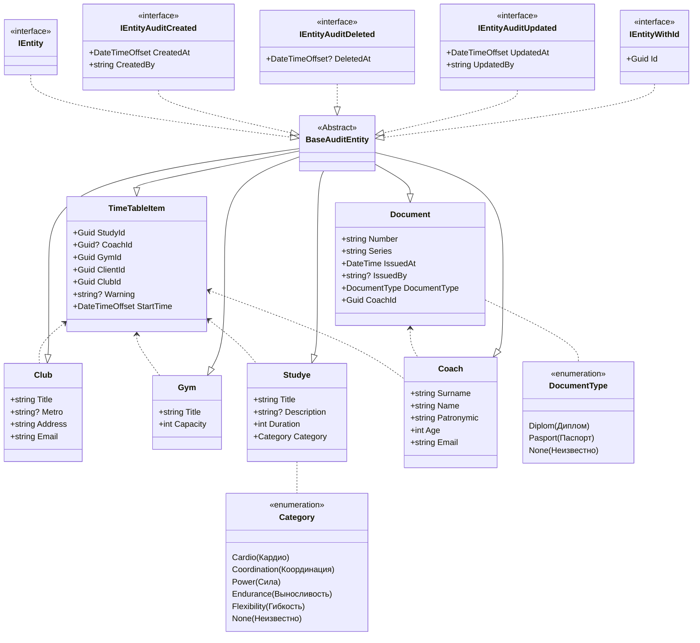

```mermaid
    classDiagram
    TimeTableItem <.. Club
    TimeTableItem <.. Gym
    TimeTableItem <.. Studye
    TimeTableItem <.. Coach
    Document <.. Coach
    Studye .. Category
    Document .. DocumentType
    BaseAuditEntity --|> Club
    BaseAuditEntity --|> Gym
    BaseAuditEntity --|> Studye
    BaseAuditEntity --|> Coach
    BaseAuditEntity --|> Document
    BaseAuditEntity --|> TimeTableItem
    IEntity ..|> BaseAuditEntity
    IEntityAuditCreated ..|> BaseAuditEntity
    IEntityAuditDeleted ..|> BaseAuditEntity
    IEntityAuditUpdated ..|> BaseAuditEntity
    IEntityWithId ..|> BaseAuditEntity
    class IEntity{
        <<interface>>
    }
    class IEntityAuditCreated{
        <<interface>>
        +DateTimeOffset CreatedAt
        +string CreatedBy
    }
    class IEntityAuditDeleted{
        <<interface>>
        +DateTimeOffset? DeletedAt
    }
    class IEntityAuditUpdated{
        <<interface>>
        +DateTimeOffset UpdatedAt
        +string UpdatedBy
    }
    class IEntityWithId{
        <<interface>>
        +Guid Id
    }        
    class Club {
        +string Title
        +string? Metro
        +string Address
        +string Email
    }
    class Gym {
        +string Title
        +int Capacity
    }
    class Studye {
        +string Title
        +string? Description
        +int Duration
        +Category Category
    }
    class Document {
        +string Number
        +string Series
        +DateTime IssuedAt
        +string? IssuedBy
        +DocumentType DocumentType
        +Guid CoachId
    }

    class Coach {
        +string Surname
        +string Name
        +string Patronymic
        +int Age
        +string Email
    }
    class TimeTableItem {
        +Guid StudyId 
        +Guid? CoachId
        +Guid GymId
        +Guid ClientId
        +Guid ClubId
        +string? Warning
        +DateTimeOffset StartTime
    }
    class DocumentType {
        <<enumeration>>
        Diplom(Диплом)
        Pasport(Паспорт)
        None(Неизвестно)
    }

  class Category {
        <<enumeration>>
        Cardio(Кардио)
        Coordination(Координация)
        Power(Сила)
        Endurance(Выносливость)
        Flexibility(Гибкость)
        None(Неизвестно)
    }
    class BaseAuditEntity {
        <<Abstract>>        
    }
```

